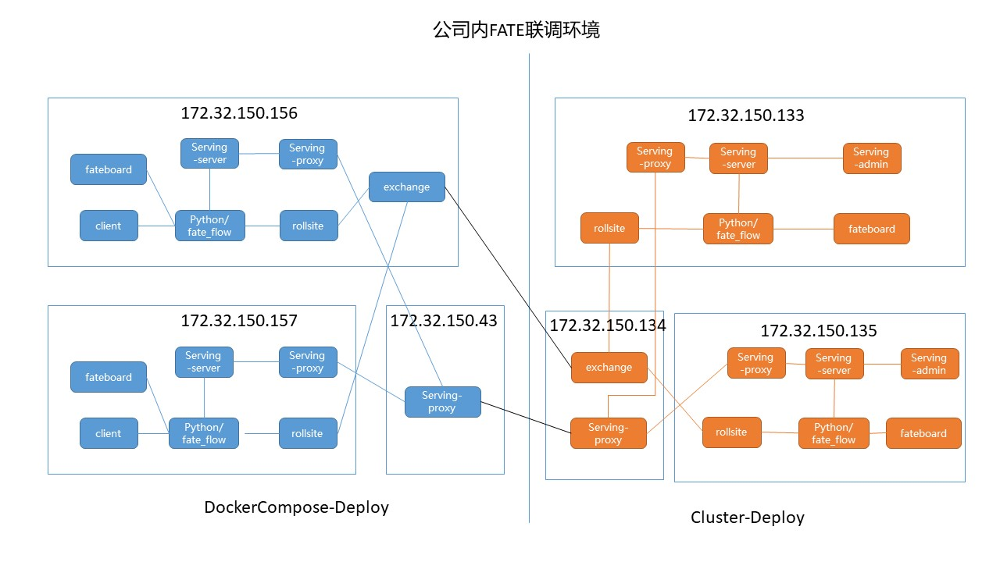

2021.1.12 添加了两边都有中转serving-proxy的情况验证

2021.1.7 今日验证了serving-proxy可以起到类似训练时exchange的作用。

# FATE-SERVING-2.0

https://webank-ai-1251170195.cos.ap-guangzhou.myqcloud.com/FATE-SERVING-2.0.html

# 安装Zookeeper

CentOS-7安装部署zookeeper集群(zookeeper-3.5.8)_zhangbeizhen18的博客-CSDN博客
https://blog.csdn.net/zhangbeizhen18/article/details/106677217/

# zookeeper启动命令：

cd /home/app/zkcluster/zookeeper-22181/bin 

sh zkServer.sh start

cd /home/app/zkcluster/zookeeper-22182/bin

sh zkServer.sh start 

cd /home/app/zkcluster/zookeeper-22183/bin

sh zkServer.sh start

# 安装serving后需要将fate_flow连接到serving

配置fate/conf/service_conf.yaml:

use_registry: true
zookeeper:
  hosts:      ——与serving中的配置保持一致
    - 127.0.0.1:22181   
    - 127.0.0.1:22182
    - 127.0.0.1:22183
  use_acl: false
  user: fate
  password: fate
servings:
  hosts:
    - 127.0.0.1:8000

# 以下参考
 https://github.com/FederatedAI/KubeFATE/blob/master/docker-deploy/README_zh.md#验证serving-service功能
 
 
 

133 host

cd fate_flow

vim examples/upload_host2.json

python fate_flow_client.py -f upload -c examples/upload_host2.json

135 guest

cd fate_flow

vim examples/upload_guest2.json

python fate_flow_client.py -f upload -c examples/upload_guest2.json

vim examples/test_hetero_lr_job_dsl2.json

vim examples/test_hetero_lr_job_conf2.json

   .......
   "job_parameters": {
        "work_mode": 1,
        "eggroll_run": {
            "eggroll.session.processors.per.node": 1
        }
    },
    .......

python fate_flow_client.py -f submit_job -d examples/test_hetero_lr_job_dsl2.json -c examples/test_hetero_lr_job_conf2.json

	    "model_info": {
            "model_id": "arbiter-8888#guest-7777#host-8888#model",
            "model_version": "202101071500593883062"
        },

等待完成

python fate_flow_client.py -f query_task -j 202101071500593883062 | grep f_status

加载模型

vim examples/publish_load_model2.json

{
    "initiator": {
        "party_id": "7777",
        "role": "guest"
    },
    "role": {
        "guest": ["7777"],
        "host": ["8888"],
        "arbiter": ["8888"]
    },
    "job_parameters": {
        "work_mode": 1,
        "model_id": "arbiter-8888#guest-7777#host-8888#model",
        "model_version": "202101071500593883062"
    }
}

python fate_flow_client.py -f load -c examples/publish_load_model2.json

绑定模型

vim examples/bind_model_service2.json

{
    "service_id": "test",
    "initiator": {
        "party_id": "7777",
        "role": "guest"
    },
    "role": {
        "guest": ["7777"],
        "host": ["8888"],
        "arbiter": ["8888"]
    },
    "job_parameters": {
        "work_mode": 1,
        "model_id": "arbiter-8888#guest-7777#host-8888#model",
        "model_version": "202101071500593883062"
    }
}

python fate_flow_client.py -f bind -c examples/bind_model_service2.json

在线测试

curl -X POST -H 'Content-Type: application/json' -i 'http://172.32.150.135:8059/federation/v1/inference' --data '{
  "head": {
    "serviceId": "test"
  },
  "body": {
    "featureData": {
      "x0": 0.254879,
      "x1": -1.046633,
      "x2": 0.209656,
      "x3": 0.074214,
      "x4": -0.441366,
      "x5": -0.377645,
      "x6": -0.485934,
      "x7": 0.347072,
      "x8": -0.287570,
      "x9": -0.733474
    },
    "sendToRemoteFeatureData": {
      "id": "123"
    }
  }
}'

return:
HTTP/1.1 200 
Content-Type: text/plain;charset=UTF-8
Content-Length: 200
Date: Thu, 07 Jan 2021 09:08:53 GMT

{"retcode":0,"retmsg":"","data":{"score":9.669779346128857E-5,"modelId":"guest#7777#arbiter-8888#guest-7777#host-8888#model","modelVersion":"
202101071500593883062","timestamp":1610009596166},"flag":0}

## 试验中转serving-proxy

在134上搭建serving-proxy,

配置conf/application.properties

# zk router
useZkRouter=false
#zk.url=localhost:2181,localhost:2182,localhost:2183

配置conf/route_table.json
{
  "route_table": {
    "default": {
      "default": [
        {
          "ip": "172.32.150.157",    --指向partyid为9999所在的serving-proxy
          "port": 8869
        }
      ]
    },
    "8888": {
      "serving": [
        {
          "ip": "172.32.150.133",
          "port": 8869		——指向8888的serving-proxy
        }
      ]
    },
    "7777": {
      "serving": [
        {
          "ip": "172.32.150.135",
          "port": 8869		——指向7777的serving-proxy
        }
      ]
    }
  },
  "permission": {
    "default_allow": true
  }
}

sh service.sh restart

修改135上的serving-proxy配置conf/route_table.json：
{
  "route_table": {
    "default": {
      "default": [
        {
          "ip": "172.32.150.134",   --指向中转serving-proxy
          "port": 8869
        }
      ]
    },
    "7777": {
      "serving": [
        {
          "ip": "172.32.150.135",
          "port": 8000	——指向7777的serving-server
        }
      ]
    }
  },
  "permission": {
    "default_allow": true
  }
}

sh service.sh restart

修改133上的serving-proxy配置conf/route_table.json：
{
  "route_table": {
    "default": {
      "default": [
        {
          "ip": "172.32.150.134",   --指向中转serving-proxy
          "port": 8869
        }
      ]
    },
    "8888": {
      "serving": [
        {
          "ip": "172.32.150.133",
          "port": 8000	——指向8888的serving-server
        }
      ]
    }
  },
  "permission": {
    "default_allow": true
  }
}

sh service.sh restart

做在线测试
curl -X POST -H 'Content-Type: application/json' -i 'http://172.32.150.135:8059/federation/v1/inference' --data '{
  "head": {
    "serviceId": "test"
  },
  "body": {
    "featureData": {
      "x0": 0.254879,
      "x1": -1.046633,
      "x2": 5.209656,
      "x3": 1.074214,
      "x4": -0.441366,
      "x5": -0.377645,
      "x6": -0.485934,
      "x7": 3.347072,
      "x8": -0.287570,
      "x9": -0.733474
    },
    "sendToRemoteFeatureData": {
      "id": "321"
    }
  }
}'

成功
HTTP/1.1 200 
Content-Type: text/plain;charset=UTF-8
Content-Length: 200
Date: Tue, 12 Jan 2021 01:56:22 GMT

{"retcode":0,"retmsg":"","data":{"score":6.223765134607322E-5,"modelId":"guest#7777#arbiter-8888#guest-7777#host-8888#model","modelVersion":"
202101071500593883062","timestamp":1610009596166},"flag":0}

如果stop 134上的serving-proxy则失败：
HTTP/1.1 200 
Content-Type: text/plain;charset=UTF-8
Content-Length: 240
Date: Thu, 07 Jan 2021 09:52:17 GMT

{"retcode":2105,"retmsg":"host return code 105 host msg :unaryCall error 172.32.150.134:8869","data":{"modelId":"guest#7777#arbiter-8888#gues
t-7777#host-8888#model","modelVersion":"202101071500593883062","timestamp":1610009596166},"flag":0}

# 验证7777到9999（即135到157）

157上：

docker exec -it confs-9999_python_1 bash

cd fate_flow/

vi examples/upload_host3.json

{
 
  	"file": "examples/data/breast_hetero_host.csv",
 
  	"head": 1,
 
  	"partition": 10,
 
  	"work_mode": 1,
 
  	"namespace": "fate_flow_test_breast",
 
  	"table_name": "breast"
}
}
·      

python fate_flow_client.py -f upload -c examples/upload_host3.json

135上：

cd fate_flow/

vi examples/test_hetero_lr_job_conf3.json

{
    "initiator": {
        "role": "guest",
        "party_id": 7777
    },
    "job_parameters": {
        "work_mode": 1,
        "eggroll_run": {
             "eggroll.session.processors.per.node": 1
        }
    },
    "role": {
        "guest": [7777],
        "host": [9999],     -- 157
        "arbiter": [9999]  -- 157
    },
    "role_parameters": {
        "guest": {
            "args": {
                "data": {
                    "train_data": [{"name": "breast", "namespace": "fate_flow_test_breast"}]
                }
            },
            "dataio_0":{
                "with_label": [true],
                "label_name": ["y"],
                "label_type": ["int"],
                "output_format": ["dense"]
            }
        },
        "host": {
            "args": {
                "data": {
                    "train_data": [{"name": "breast", "namespace": "fate_flow_test_breast"}]
                }
            },
             "dataio_0":{
                "with_label": [false],
                "output_format": ["dense"]
            }
        }
    },
    "algorithm_parameters": {
        "hetero_lr_0": {
            "penalty": "L2",
            "optimizer": "rmsprop",
            "alpha": 0.01,
            "max_iter": 3,
            "batch_size": 320,
            "learning_rate": 0.15,
            "init_param": {
                "init_method": "random_uniform"
            }
        }
    }
}

python fate_flow_client.py -f submit_job -d examples/test_hetero_lr_job_dsl2.json -c examples/test_hetero_lr_job_conf3.json

加载模型

vim examples/publish_load_model3.json

{
    "initiator": {
        "party_id": "7777",
        "role": "guest"
    },
    "role": {
        "guest": ["7777"],
        "host": ["9999"],
        "arbiter": ["9999"]
    },
    "job_parameters": {
        "work_mode": 1,
        "model_id": "arbiter-9999#guest-7777#host-9999#model",
        "model_version": "202101071820454723313"
    }
}

python fate_flow_client.py -f load -c examples/publish_load_model3.json

绑定模型

vim examples/bind_model_service3.json

{
    "service_id": "test9999",
    "initiator": {
        "party_id": "7777",
        "role": "guest"
    },
    "role": {
        "guest": ["7777"],
        "host": ["9999"],
        "arbiter": ["9999"]
    },
    "job_parameters": {
        "work_mode": 1,
        "model_id": "arbiter-9999#guest-7777#host-9999#model",
        "model_version": "202101071820454723313"
    }
}

python fate_flow_client.py -f bind -c examples/bind_model_service3.json

在线测试

curl -X POST -H 'Content-Type: application/json' -i 'http://172.32.150.135:8059/federation/v1/inference' --data '{
  "head": {
    "serviceId": "test9999"
  },
  "body": {
    "featureData": {
      "x0": 0.254879,
      "x1": -1.046633,
      "x2": 5.209656,
      "x3": 1.074214,
      "x4": -0.441366,
      "x5": -0.377645,
      "x6": -0.485934,
      "x7": 3.347072,
      "x8": -0.287570,
      "x9": -0.733474
    },
    "sendToRemoteFeatureData": {
      "id": "321"
    }
  }
}'

返回：
HTTP/1.1 200 
Content-Type: text/plain;charset=UTF-8
Content-Length: 199
Date: Thu, 07 Jan 2021 10:29:48 GMT

{"retcode":0,"retmsg":"","data":{"score":0.00288022144318545,"modelId":"guest#7777#arbiter-9999#guest-7777#host-9999#model","modelVersion":"2
02101071820454723313","timestamp":1610015104776},"flag":0}

# 继续试验经过两次中转  7777到9999 （135->134->43->157，134是133和135对外的serving-proxy，43是157和156对外的serving-proxy)

134上：

修改fate-serving-proxy/conf/route_table.json:

{
  "route_table": {
    "default": {
      "default": [
        {
          "ip": "172.32.150.43",
          "port": 8869		——指向另一个中转节点43的serving-proxy
        }
      ]
    },
    "8888": {
      "default": [
        {
          "ip": "172.32.150.133",
          "port": 8869
        }
      ]
    },
    "7777": {
      "default": [
        {
          "ip": "172.32.150.135",
          "port": 8869
        }
      ]
    }
  },
  "permission": {
    "default_allow": true
  }
}

43上：

根据156上docker-compose安装方式生成的/usr/local/KubeFATE/docker-deploy/outputs/default-serving-proxy/serving-10000.tar展开修改，
仅保留serving-proxy部分（即去除serving-server、redis），后打包生成default-serving-proxy.tar，传到43的/mnt/disk01/fangjin/fate下，解压

修改default-serving-proxy/confs/serving-proxy/conf/route_table.json:

{
    "route_table": {
        "10000": {
            "default": [
                {
                    "ip": "172.32.150.156",
                    "port": 8869			——指向10000的serving-proxy
                }
            ]
        },
        "9999": {
            "default": [
                {
                    "ip": "172.32.150.157",
                    "port": 8869			——指向9999的serving-proxy
                }
            ]
        },
        "default": {
            "default": [
                {
                    "ip": "172.32.150.134",
                    "port": 8869			——指向134的serving-proxy
                }
            ]
        }
    },
    "permission": {
        "default_allow": true
    }
}

docker-compose down

docker-compose up -d

157上：

修改/data/projects/fate/serving-9999/confs/serving-proxy/conf/route_table.json:

{
    "route_table": {
        "10000": {
            "default": [
                {
                    "ip": "172.32.150.156",
                    "port": 8869
                }
            ]
        },
        "9999": {
            "default": [
                {
                    "ip": "serving-proxy",
                    "port": 8059
                }
            ],
            "serving": [
                {
                    "ip": "serving-server",
                    "port": 8000
                }
            ]
        },
        "default": {
            "default": [
                {
                    "ip": "172.32.150.43",
                    "port": 8869			——指向43的serving-proxy
                }
            ]
        }
    },
    "permission": {
        "default_allow": true
    }
}

在线测试：

curl -X POST -H 'Content-Type: application/json' -i 'http://172.32.150.135:8059/federation/v1/inference' --data '{
  "head": {
    "serviceId": "test9999"
  },
  "body": {
    "featureData": {
      "x0": 0.254879,
      "x1": -1.046633,
      "x2": 5.209656,
      "x3": 1.074214,
      "x4": -0.441366,
      "x5": -0.377645,
      "x6": -0.485934,
      "x7": 3.347072,
      "x8": -0.287570,
      "x9": -0.733474
    },
    "sendToRemoteFeatureData": {
      "id": "321"
    }
  }
}'

成功
HTTP/1.1 200 
Content-Type: text/plain;charset=UTF-8
Content-Length: 199
Date: Tue, 12 Jan 2021 02:52:21 GMT

{"retcode":0,"retmsg":"","data":{"score":0.00288022144318545,"modelId":"guest#7777#arbiter-9999#guest-7777#host-9999#model","modelVersion":"2
02101071820454723313","timestamp":1610015104776},"flag":0}

